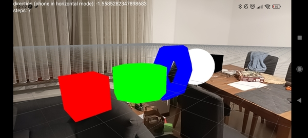

# AugmentedReality

* uses [THREE.js](https://threejs.org/) to render 3D Environments
* uses [Expo Sensors](https://docs.expo.dev/versions/latest/sdk/sensors/) to estimate the position as well as to detect motion (step detection)
* allows to specify 3D objects to display on the GPS coordinate system. Objects close to the user (based on their GPS position) will be shown.